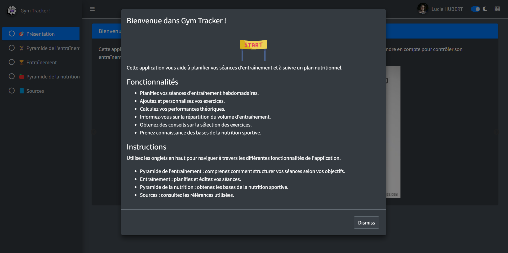

# Gym Tracker Shiny App

## Overview

Welcome to Gym Tracker! This Shiny application helps you plan your workout sessions and track your nutritional plan. Whether you're a fitness enthusiast, athlete, or coach, Gym Tracker provides tools to enhance your training experience !

## Features

- **Weekly Workout Planning**: Plan and schedule your weekly workout sessions.
- **Exercise Customization**: Add and personalize exercises to suit your training needs.
- **Theoretical Performance Calculation**: Calculate theoretical performance metrics based on your inputs.
- **Training Volume Distribution**: Understand and visualize your training volume distribution.
- **Exercise Selection Tips**: Get guidance on selecting appropriate exercises for your goals.
- **Sports Nutrition Basics**: Learn fundamentals of sports nutrition to support your fitness journey.

## Instructions

1. Use the tabs at the top to navigate through different features of the application:
   - **Présentation**: Overview and introduction.
   - **Training**: Plan and edit your workout sessions.
   - **Nutrition**: Learn basics of sports nutrition.
   - **Sources**: View used references and credits.

*Image credit: The Muscle and Strength Pyramids: nutrition and training. (2023). [muscleandstrengthpyramids.com](https://muscleandstrengthpyramids.com/)*

## Installation

To run this application locally, ensure you have R and Shiny installed. Clone this repository and open the `app.R` file in RStudio. Run the application using the `Run App` button in RStudio.
